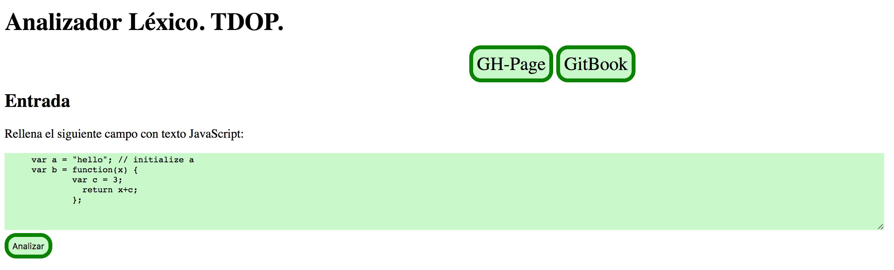
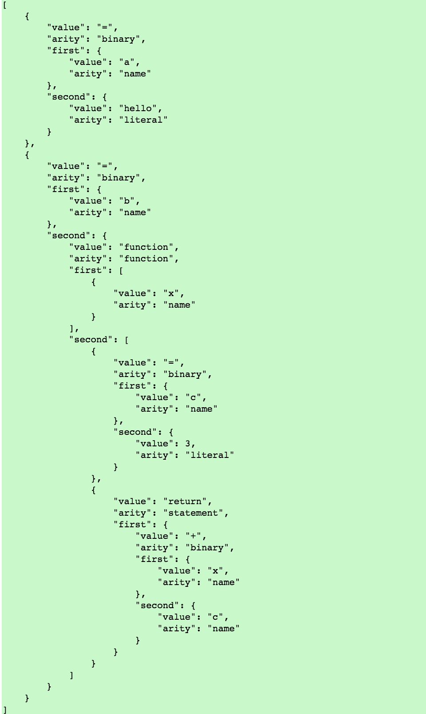

# Analizador Léxico TDOP.

## Introducción

Un compilador se compone de **análisis** y **síntesis**. Dentro del análisis podemos distinguir tres tipos:
   - El **análisis léxico**: Descompone y lee carácter por carácter la información creando componentes léxicos. Luego se envía al análisis sintáctico.
   - El **análisis sintáctico**: Este comprueba los componentes léxicos que fueron enviados por el análisis léxico, lo interpreta y genera un árbol sintáctico, para ser enviado al análisis semántico.
   - El **análisis semántico**: Comprueba la validez semántica de las sentencias aceptadas en la fase anterior.

En este capítulo solo nos centraremos en el análisis léxico, concretamente el **TDOP**.

## Analizador léxico TDOP

**TDOP** son las siglas de **Top Down Operator Precedence**
Es la primera fase de un compilador consistente en un programa que recibe como entrada el código fuente de otro programa (secuencia de caracteres) y produce una salida compuesta de tokens (componentes léxicos) o símbolos. Estos tokens sirven para una posterior etapa del proceso de traducción, siendo la entrada para el analizador sintáctico

En el **Top Down Operator Precedence** se combinan las mejores propiedades de recursividad descendente y la precedencia de operadores de Floyd. Se utilizan los **tokens** en lugar de las reglas gramaticales. A estos **tokens** se les conoce por **componentes léxicos** y son la unidad mínima de información que significa algo a la hora de compilar; concepto de palabra; las fases de un lenguaje constan de cadenas de componentes léxicos.

En nuestra práctica hemos desarrollado nuestro analizador léxico y su aspecto final es el siguiente:

Si ejecutaramos lo anterior, tendríamos como resultado:

